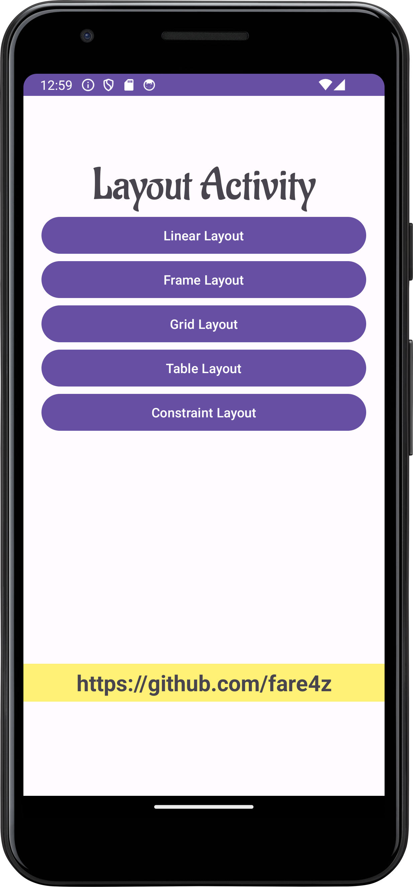

# LayoutClassActivity



This repository serves as a continuation of the lab activity for DDT 5B and DDT5C on 29/2/2024, providing an example for students to understand Android layout using Java language. It covers various layout types including Linear Layout, Frame Layout, Grid Layout, Table Layout, and Constraint Layout.

## Layout Types Covered:

1. **Linear Layout**: Linear layout arranges components linearly either horizontally or vertically.
2. **Frame Layout**: Frame layout is designed to block out an area on the screen to display a single item.
3. **Grid Layout**: Grid layout is a layout manager that arranges its children in a grid.
4. **Table Layout**: Table layout is a view group that arranges its children into rows and columns.
5. **Constraint Layout**: Constraint layout allows you to create large and complex layouts with a flat view hierarchy.

## Usage

1. Clone the repository:
   ```bash
   git clone https://github.com/fare4z/LayoutClassActivity.git
2. Open the project in Android Studio.
3. Navigate to the desired example to understand the several type of layout.
4. Run the examples on an Android emulator or device.

